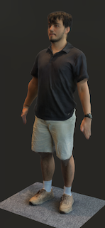
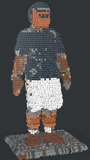

# LEGO-tizer: 3D Model to LEGO Conversion Tool

This project was developed as part of my internship at [Valensas](https://valensas.com). It provided valuable experience in 3D model processing, texture mapping, and working with LEGO-compatible formats. The tool is a practical example of applying computer graphics and 3D processing techniques in a real-world scenario.

The LEGO-tizer tool converts 3D models into LEGO-compatible formats, allowing the creation of LEGO brick versions of complex models. This tool processes OBJ files, applies textures based on MTL files, and generates LEGO-compatible LDR files.

## Some Suggestions
**`Use 3D scanners with Lidar sensors for better performance!!! Also a better lightning while doing the scanning can help the program to sample colors from the textures.`**

## Features

- **OBJ to LDR Conversion**: Converts 3D models from OBJ format to LEGO-compatible LDR format.
- **Texture Mapping**: Applies textures from MTL files to the 3D model.
- **LEGO-tization**: Rounds and scales model vertices to align with LEGO brick grids.
- **Brick Grouping**: Groups bricks and replaces smaller bricks with larger ones for optimization.


## Dependencies
- [Pytorch3D](https://github.com/facebookresearch/pytorch3d)
- **Torch**
- **Pillow (PIL)**
- **Numpy**

## Installation

1. **Clone the repository**:
   ```bash
   git clone https://github.com/odulsuzkisafilm/lego-tizer.git
   cd lego-tizer
   ```
2. **Install the required dependencies**:
Make sure you have Python installed, then install the dependencies using pip:
   ```bash
   pip install -r requirements.txt
   ```

## Usage
To run the tool, use the following command:
```bash
python main.py <obj_path> <mtl_path> <texture_dir> [<output_path>]
```

- `<obj_path>`: Path to the OBJ file.
- `<mtl_path>`: Path to the MTL file.
- `<texture_dir>`: Directory containing the textures referenced in the MTL file.
- `[<obj_path>]`: (Optional) Path to save the output LDR file. Defaults to output.ldr if not provided.

## Example
### Input and Output:
Here is an example input 3D model and its generated LEGO-compatible LDR file:

<p align="left">
  
  
</p>

## Project Structure

- **main.py**: The entry point for the application. Handles command-line arguments and runs the main conversion process.
- **lego_tizer/io**:
  - `obj_loader.py`: Handles loading OBJ files.
  - `mtl_parser.py`: Parses MTL files to extract material and texture information.
  - `texture_loader.py`: Loads textures based on the MTL file.
  - `ldr_writer.py`: Functions for writing LDR files.
- **lego_tizer/processing**:
  - `color_mapping.py`: Handles mapping of colors to LEGO colors.
  - `mesh_operations.py`: Functions for manipulating mesh data, including scaling and LEGO-tization.
  - `texture_operations.py`: Combines and applies textures to the mesh.
  - `brick_operations.py`: Handles the grouping and replacement of bricks for optimization.
- **lego_tizer/utils**:
  - `debug.py`: Utility functions for debugging the texture application.

## Acknowledgments
Thanks to [Valensas](https://valensas.com) for the opportunity to work on this project.